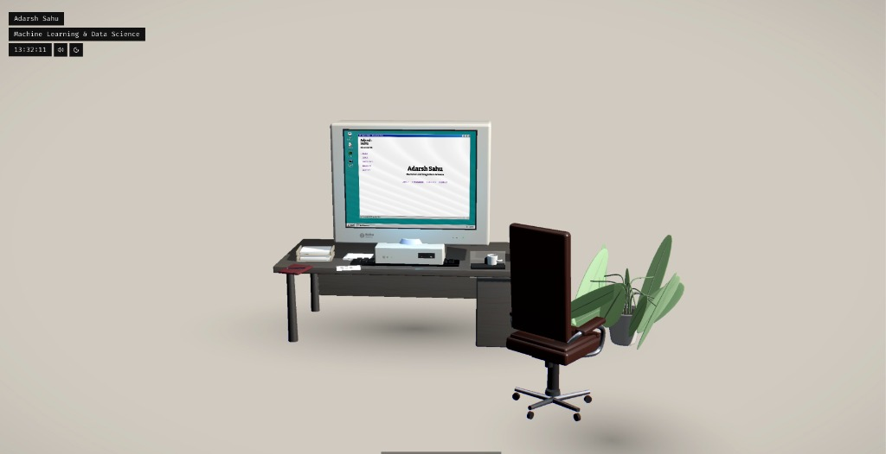
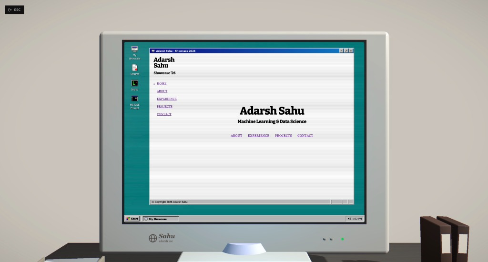

# 🕹️ 3D Interactive Retro Room Developer Portfolio

[](https://retro-room-portfolio.vercel.app)
[](https://react.dev/)
[](https://threejs.org/)
[](https://vitejs.dev/)

An immersive, interactive 3D Retro Room Developer Portfolio built for **Adarsh Sahu** (Machine Learning & Data Science Engineer). 

Inspired by classic workstation aesthetics and modern 3D web design, this portfolio immerses visitors in a detailed 3D retro office room complete with an interactive CRT computer, virtual operating system, live ambient synthesizers, and mini-games.

👉 **[Experience the Live Web App](https://retro-room-portfolio.vercel.app)**

---

## 📸 Screenshots

| 3D Retro Room Overview | Virtual Desktop OS (Showcase '26) |
| :---: | :---: |
|  |  |

---

## ✨ Features

- **🌐 Interactive 3D Room Environment**:
  - Smooth 3D camera controls with room exploration and desk sit-down views.
  - Interactive 3D desk clutter: Desk lamp toggle, PC power switch, ceiling lights, and retro cassette/game props.
- **🖥️ Virtual Desktop OS (Showcase '26)**:
  - Custom retro window manager running directly inside the CRT monitor frame in 3D space.
  - Showcase App detailing **About Me**, **Experience**, **Projects** (AI/ML & Web), and **Contact**.
- **🎵 Real-Time Web Audio Synthesizer & Jukebox**:
  - Built-in Web Audio API sound engine that synthesizes lo-fi background tracks live using browser oscillators.
  - Built-in jukebox containing popular Indian Hits, English Hits, and Classic Ghazals.
- **🎮 Interactive Mini-Games**:
  - Fully playable retro Snake game running directly inside the desktop OS windows.
- **📷 Photo Mode & Customization**:
  - Built-in Photo Mode for high-res clean camera captures.
  - Toggle between ambient dark mode lighting and daylight ceiling illumination.

---

## 🛠️ Tech Stack

- **Frontend**: React 19, Vite, Tailwind CSS, Lucide Icons
- **3D Graphics & Canvas**: Three.js, React Three Fiber (`@react-three/fiber`), Drei (`@react-three/drei`)
- **Audio Engine**: Web Audio API (Live procedural synthesizer & MP3 player)
- **Deployment**: Vercel

---

## 🚀 Getting Started Locally

### Prerequisites
- **Node.js**: `v18+` or `v20+`
- **npm** or **yarn**

### Installation & Run

1. **Clone the Repository**:
   ```bash
   git clone https://github.com/addaarrssh/retro-room-portfolio.git
   cd retro-room-portfolio
   ```

2. **Install Dependencies**:
   ```bash
   npm install
   ```

3. **Start Local Development Server**:
   ```bash
   npm run dev
   ```
   Open `http://localhost:5173/` in your web browser.

4. **Build for Production**:
   ```bash
   npm run build
   ```

---

## 👨‍💻 Author

**Adarsh Sahu**  
*Machine Learning & Data Science Engineer*  
- **Portfolio**: [retro-room-portfolio.vercel.app](https://retro-room-portfolio.vercel.app)
- **GitHub**: [@addaarrssh](https://github.com/addaarrssh)

---

## 📜 License

This project is open source and available under the [MIT License](LICENSE).
